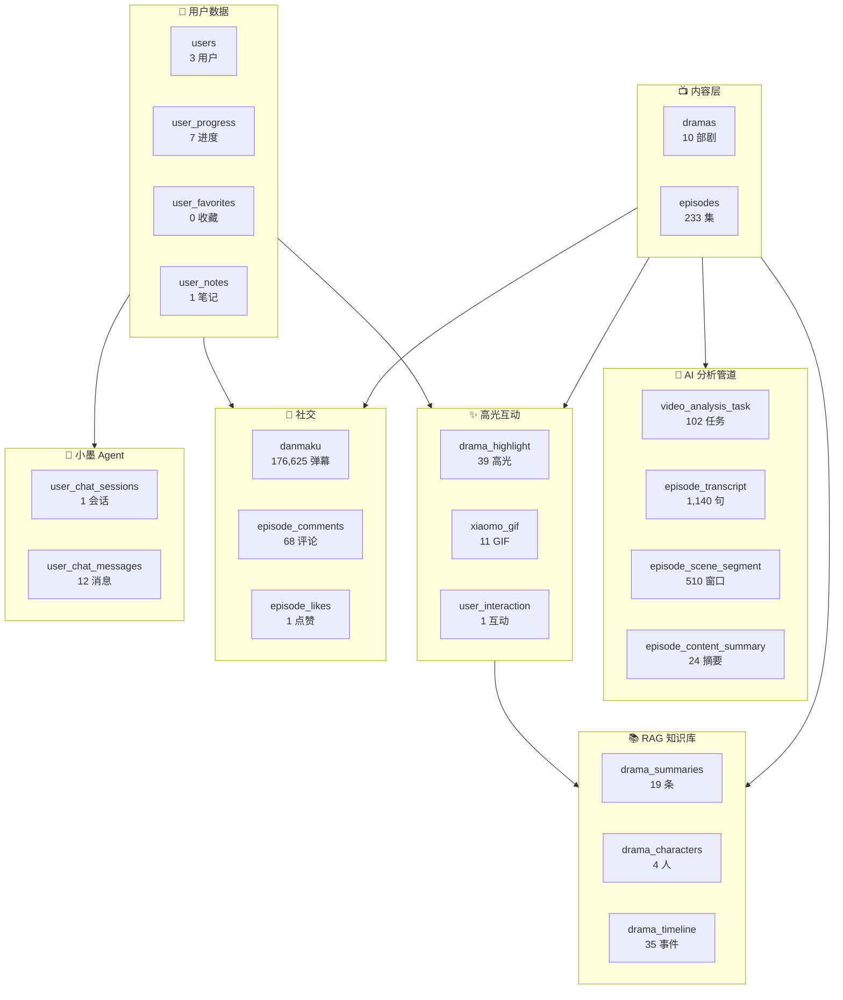
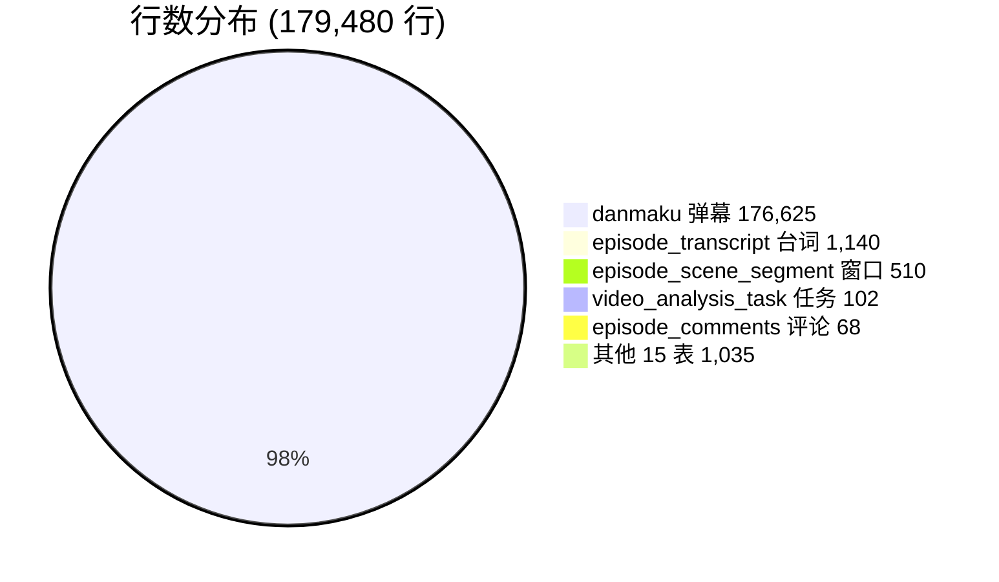

# 青墨数据库 ER 图

> 2026-06-30 审计 | 21 张表 | ~179k 行 | 0 死表 | 4 死列

## 全量 ER 图

```mermaid
erDiagram
    %% ========== 内容层 ==========
    DRAMAS ||--o{ EPISODES : "1:N drama_id"
    DRAMAS ||--o{ DRAMA_CHARACTERS : "1:N drama_id"
    DRAMAS ||--o{ DRAMA_TIMELINE : "1:N drama_id"
    DRAMAS ||--o{ DRAMA_SUMMARIES : "1:N drama_id"
    DRAMAS ||--o{ DRAMA_HIGHLIGHT : "1:N drama_id"
    DRAMAS ||--o{ USER_FAVORITES : "1:N drama_id"

    EPISODES ||--o{ EPISODE_TRANSCRIPT : "1:N episode_id"
    EPISODES ||--o{ EPISODE_SCENE_SEGMENT : "1:N episode_id"
    EPISODES ||--o{ EPISODE_CONTENT_SUMMARY : "1:N episode_id"
    EPISODES ||--o{ DRAMA_HIGHLIGHT : "1:N episode_id"
    EPISODES ||--o{ DANMAKU : "1:N episode_id"
    EPISODES ||--o{ EPISODE_COMMENTS : "1:N episode_id"
    EPISODES ||--o{ EPISODE_LIKES : "1:N episode_id"
    EPISODES ||--o{ USER_PROGRESS : "1:N episode_id"
    EPISODES ||--o{ USER_NOTES : "1:N episode_id"
    EPISODES ||--o{ USER_INTERACTION : "1:N episode_id"
    EPISODES ||--o{ VIDEO_ANALYSIS_TASK : "1:N episode_id"
    EPISODES ||--o{ DRAMA_SUMMARIES : "1:N episode_id"

    %% ========== 用户层 ==========
    USERS ||--o{ USER_PROGRESS : "1:N user_id"
    USERS ||--o{ USER_FAVORITES : "1:N user_id"
    USERS ||--o{ EPISODE_LIKES : "1:N user_id"
    USERS ||--o{ EPISODE_COMMENTS : "1:N user_id"
    USERS ||--o{ DANMAKU : "1:N user_id"
    USERS ||--o{ USER_NOTES : "1:N user_id"
    USERS ||--o{ USER_CHAT_SESSIONS : "1:N user_id"
    USERS ||--o{ USER_INTERACTION : "1:N user_id"

    %% ========== 内部关联 ==========
    USER_CHAT_SESSIONS ||--o{ USER_CHAT_MESSAGES : "1:N session_id"
    DRAMA_HIGHLIGHT ||--o{ USER_INTERACTION : "1:N highlight_id"
    DRAMA_HIGHLIGHT }o--|| XIAOMO_GIF : "xiaomo_gif_code"
    EPISODE_COMMENTS ||--o{ EPISODE_COMMENTS : "parent_id 自引用"

    %% ========== 表定义 ==========
    DRAMAS {
        int id PK "剧集ID"
        string title "剧名"
        string description "简介"
        string cover_url "封面图URL"
        int total_episodes "总集数"
        string tags "标签 / 分隔"
        int fav_count "收藏数"
    }

    EPISODES {
        int episode_id PK "全局唯一 episode_id = drama_id * 1000 + ep_num"
        int drama_id FK "所属剧"
        int episode_num "集号"
        string title "单集标题"
        int duration "时长秒"
        string video_url "MP4路径"
        string thumbnail_url "缩略图URL"
        int like_count "点赞数"
    }

    USERS {
        int id PK
        string username "登录名"
        string password_hash "SHA-256 + salt"
        string nickname "昵称"
        string avatar "头像URL"
        datetime created_at
        datetime updated_at
    }

    %% ========== AI 分析管道 ==========
    VIDEO_ANALYSIS_TASK {
        int id PK
        int drama_id FK
        int episode_id FK
        string video_path "源MP4路径"
        string status "pending / running / completed / failed"
        int progress "进度 0-100"
        string result_json "死列 未使用"
        string error_message "错误日志"
        datetime created_at
        datetime updated_at
    }

    EPISODE_TRANSCRIPT {
        int id PK
        int drama_id FK
        int episode_id FK
        int start_time_ms "起始毫秒"
        int end_time_ms "结束毫秒"
        string speaker "死列 待HF_TOKEN激活"
        string text "台词原文"
        string source_type "funasr / faster_whisper"
    }

    EPISODE_SCENE_SEGMENT {
        int id PK
        int drama_id FK
        int episode_id FK
        int start_time_ms "窗口起始"
        int end_time_ms "窗口结束"
        string summary "LLM窗口摘要"
        string dialogue_text "窗口内台词拼接"
        string visual_summary "豆包多模态画面描述"
        string emotion_tags_json "情绪标签JSON"
    }

    EPISODE_CONTENT_SUMMARY {
        int id PK
        int drama_id FK
        int episode_id FK
        string title "摘要标题"
        string short_summary "短摘要"
        string long_summary "长摘要"
        string character_actions_json "人物动作JSON"
        string plot_points_json "情节点JSON"
    }

    %% ========== RAG 知识库 ==========
    DRAMA_SUMMARIES {
        int id PK
        int drama_id FK
        int episode_id FK
        string summary "剧情摘要 旧版豆包生成"
        datetime created_at
    }

    DRAMA_CHARACTERS {
        int id PK
        int drama_id FK
        string name "角色名"
        string role "定位 男主/女主/反派"
        string description "角色简介"
        string relationships "死列 角色关系"
        datetime created_at
    }

    DRAMA_TIMELINE {
        int id PK
        int drama_id FK
        int episode_id FK
        float time_sec "时间秒"
        string event_type "事件类型"
        string event_desc "事件描述"
        string characters "死列 关联角色"
        datetime created_at
    }

    %% ========== 高光互动 ==========
    DRAMA_HIGHLIGHT {
        int id PK
        int drama_id FK
        int episode_id FK
        string highlight_type "slapback / suspense / heartbreak / comedy / action"
        int start_time_ms "高光起始"
        int end_time_ms "高光结束"
        int hint_offset_ms "触发偏移"
        string title "高光标题"
        string description "描述"
        string evidence_json "证据 dialogue+visual+reason"
        float confidence "置信度 0-1"
        string interaction_type "support_button / reaction_panel / choice_panel"
        string interaction_config "互动配置JSON"
        string bubble_text "气泡吐槽文案"
        string xiaomo_gif_code FK "小墨GIF动效code"
        int priority "优先级"
        string status "enabled / draft / ai_pending_review"
    }

    XIAOMO_GIF {
        int id PK
        string code UK "动效唯一码"
        string name "动效名称"
        string gif_url "GIF文件路径"
        string highlight_type "对应高光类型"
        string description "描述"
        string status "active / inactive"
        datetime created_at
    }

    USER_INTERACTION {
        int id PK
        string user_id FK "登录用户ID 匿名时为NULL"
        string device_id "匿名设备ID"
        int drama_id FK
        int episode_id FK
        int highlight_id FK
        string interaction_type "support_button / reaction / choice"
        string option_key "选项key"
        datetime created_at
    }

    %% ========== 社交 ==========
    DANMAKU {
        int id PK
        string user_id FK "发送者"
        int episode_id FK
        string text "弹幕文本"
        float time_sec "视频时间秒"
        string color "颜色"
        datetime created_at
    }

    EPISODE_COMMENTS {
        int id PK
        int episode_id FK
        int parent_id FK "父评论ID 自引用"
        string reply_to_user_id "回复目标用户"
        string reply_to_nickname "回复目标昵称"
        string user_id FK "评论者"
        string nickname "昵称"
        string avatar_url "头像"
        string text "评论内容"
        datetime created_at
    }

    EPISODE_LIKES {
        int id PK
        string user_id FK
        int episode_id FK
        datetime created_at
    }

    %% ========== 用户数据 ==========
    USER_PROGRESS {
        int id PK
        string user_id FK
        int episode_id FK
        int progress "观看进度毫秒"
        int watched "是否看完 0/1"
        datetime updated_at
    }

    USER_FAVORITES {
        int id PK
        string user_id FK
        int drama_id FK
        datetime created_at
    }

    USER_NOTES {
        int id PK
        string user_id FK
        int episode_id FK
        string note_text "笔记内容"
        float time_sec "关联视频时间"
        datetime created_at
    }

    %% ========== 小墨 Agent ==========
    USER_CHAT_SESSIONS {
        int id PK
        string user_id FK
        string title "会话标题"
        int drama_id "关联剧集 可为空"
        datetime created_at
        datetime updated_at
    }

    USER_CHAT_MESSAGES {
        int id PK
        int session_id FK
        string role "user / assistant"
        string content "消息内容"
        datetime created_at
    }
```

---

## 表域分组

---

## 死列清单

| 表.列 | 类型 | 原因 | 后续 |
|------|------|------|------|
| `drama_characters.relationships` | TEXT | 流水线未对接 | 跨集聚合脚本 |
| `drama_timeline.characters` | TEXT | 同上 | 同上 |
| `episode_transcript.speaker` | TEXT | 需 HF_TOKEN | 设 token + --diarize |
| `video_analysis_task.result_json` | TEXT | 未使用 | 可删或对接 |

---

## 关键设计约定

| 约定 | 说明 |
|------|------|
| episode_id 公式 | `drama_id × 1000 + ep_num`，全局唯一 |
| AIGC 分支 | episode_id 后缀 `B1/B2`，如 `2017_B1` |
| 标签存储 | 单字段 `/` 分隔，`instr` 精准匹配防误伤 |
| 匿名兼容 | `user_id` 字段同时接受字符串 device_id 和整数 user_id |
| 评论模型 | 平级嵌套，`parent_id` 自引用，统一 16dp 缩进 |
| 高光状态 | `draft` → `ai_pending_review` → `enabled`，默认 draft |

---

## 数据量分布

