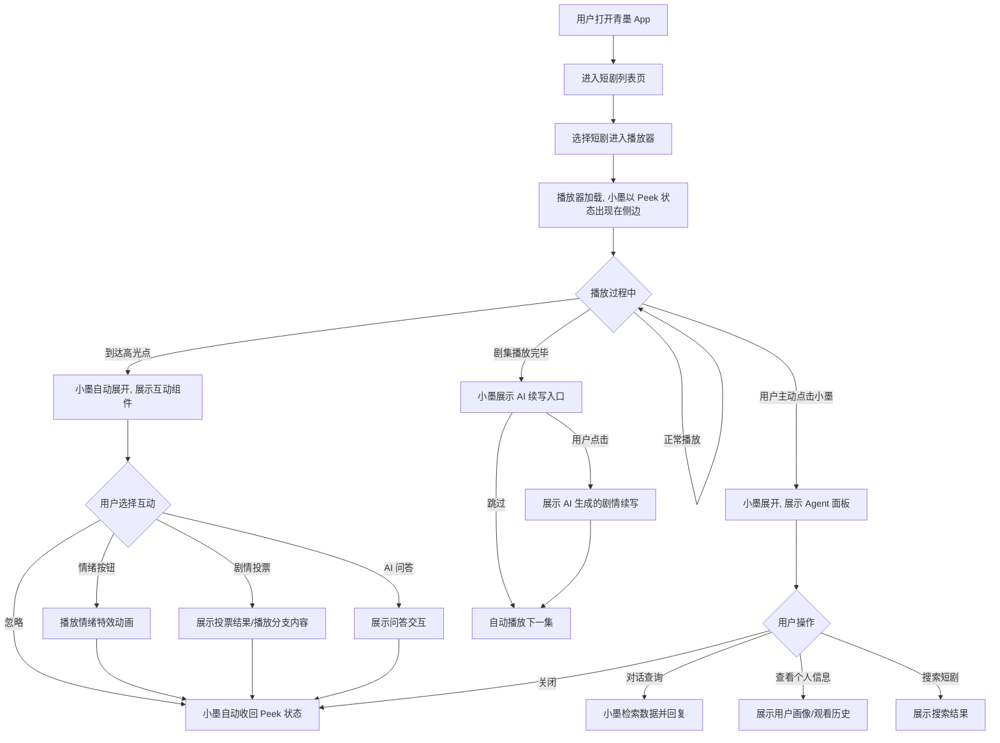
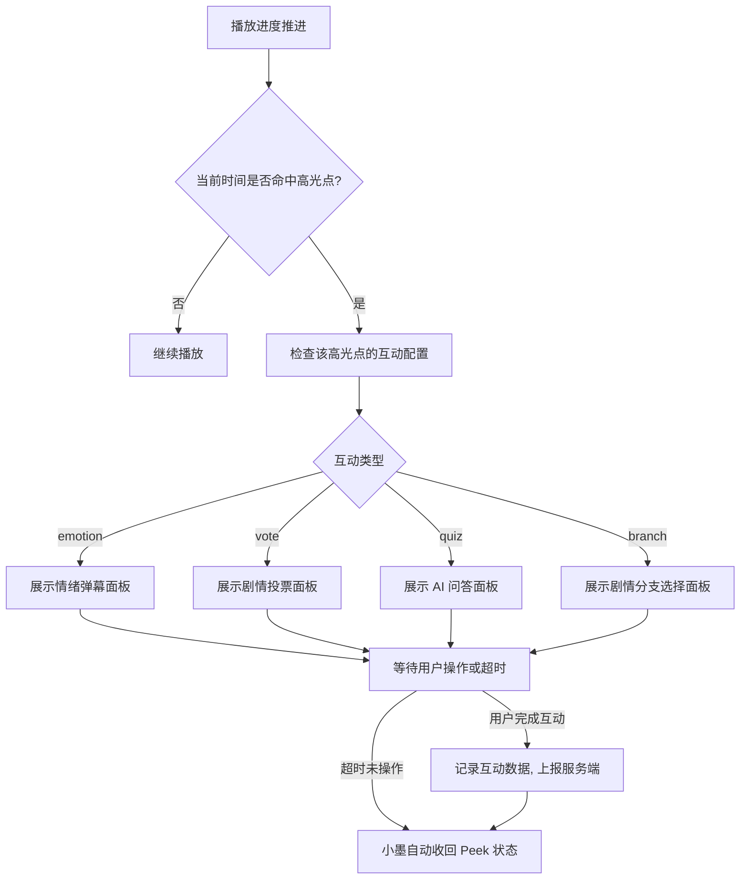
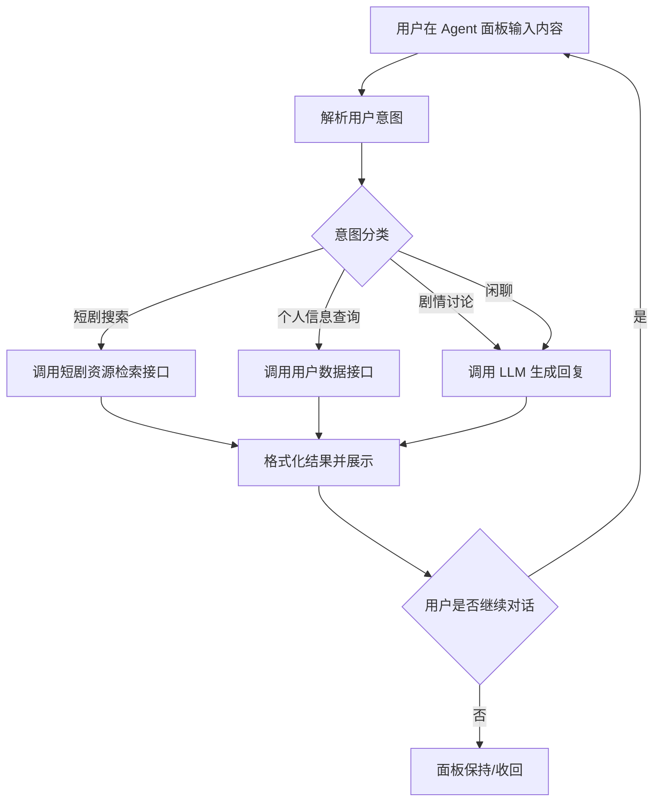
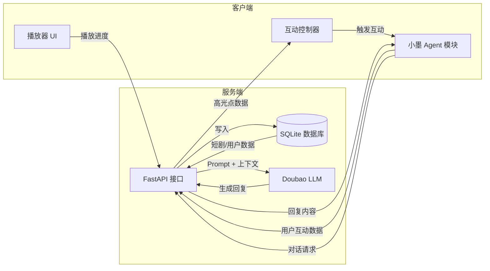
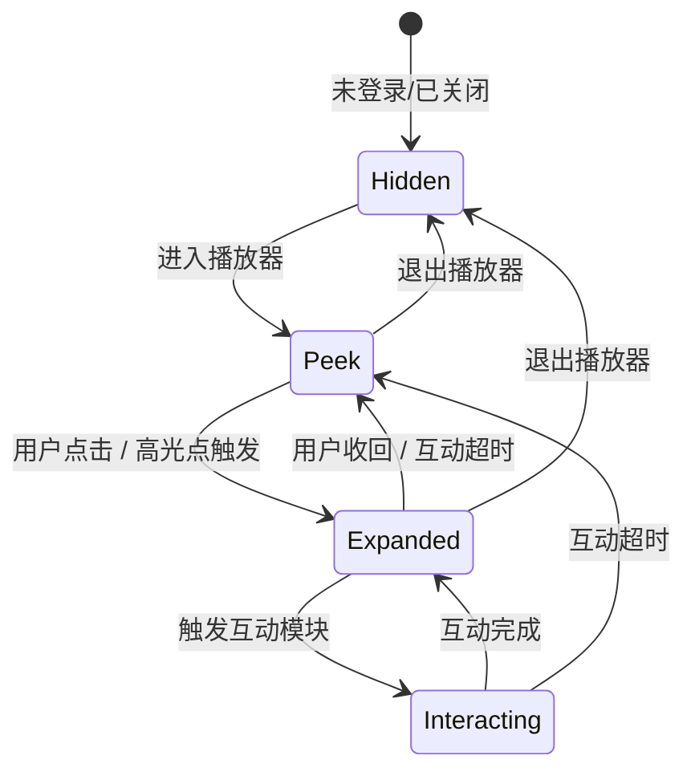
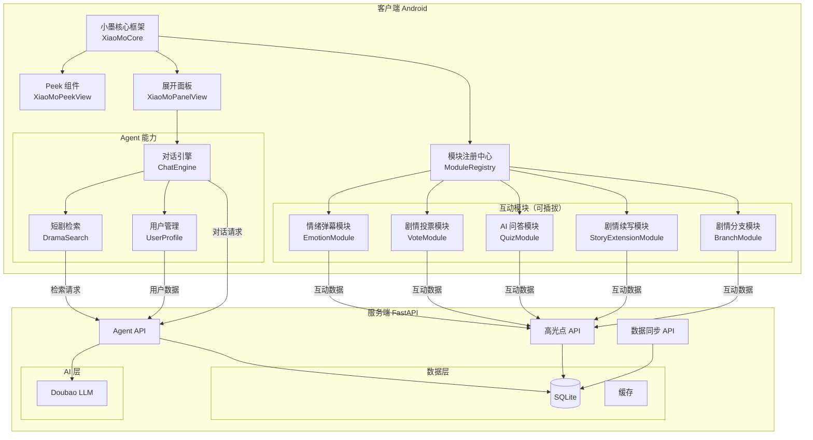
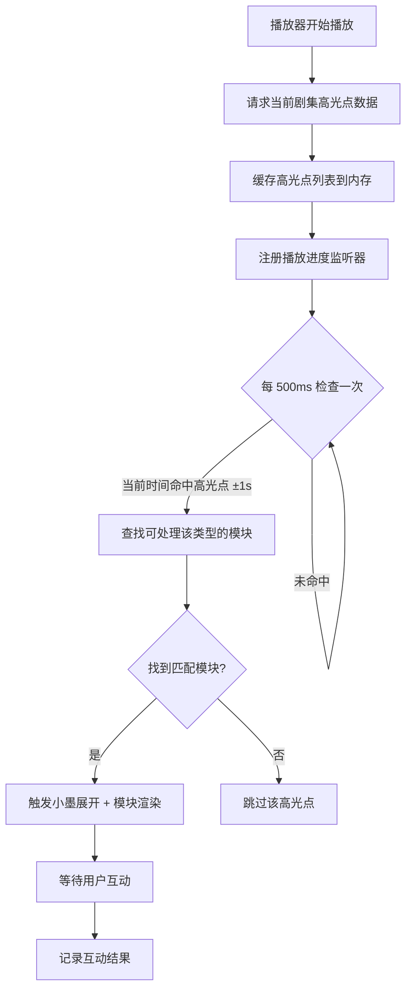
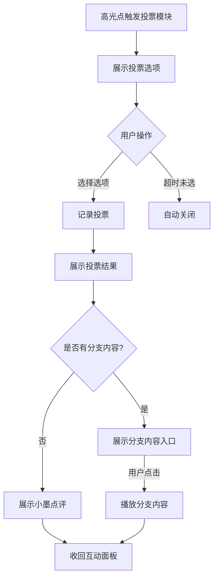
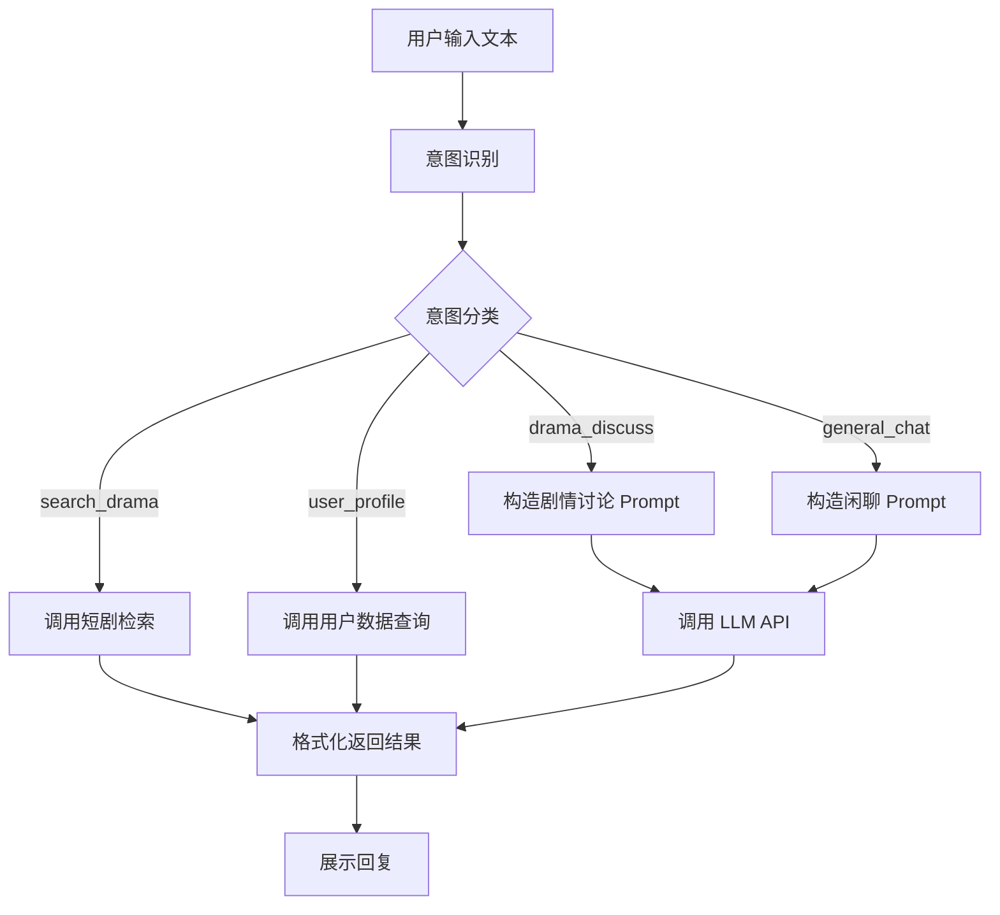
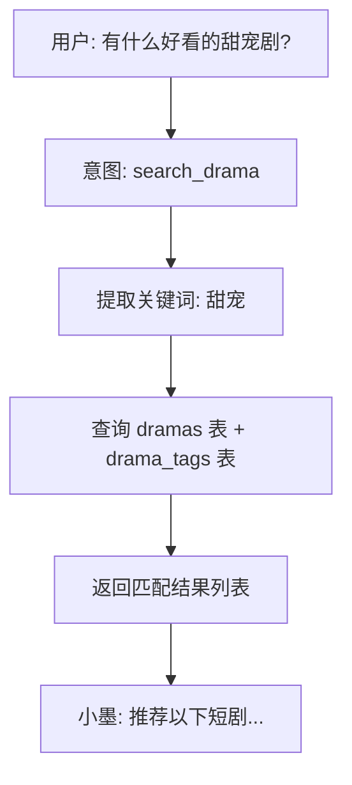

# 青墨短剧 — 小墨 Agent 产品需求文档（PRD）

> 版本号：V1.0.0

| 版本   | 时间       | 修订人 | 备注               |
|--------|-----------|--------|-------------------|
| V1.0.0 | 2026/05/29 | —      | 创建 V1.0.0 版本   |

---

## 一、概述（为什么做）

### 1.1 产品概述及目标

#### 1.1.1 背景介绍

短剧场景中存在大量剧情高光、反转、名场面等情绪峰值时刻。当前市面上的产品主要通过弹幕和评论来承载用户的情绪表达，但这两类方式都需要输入文字，表达门槛高，且会中断观看体验。

青墨短剧平台已有基础的短剧列表、播放、高光点数据存储能力，但高光点互动尚未在客户端落地。本次需求旨在引入一个拟人化的 AI Agent「小墨」，作为用户的观剧伙伴，在高光时刻主动触发互动、提供情绪陪伴，并承担用户信息管理和短剧资源检索的职责。

**比赛课题要求**（AI全栈项目 — 基于短剧剧情的即时互动激发）：
- 完成剧集内容的高光点打标和存储，在客户端播放时下发高光点信息（已有基础）
- 客户端高光点互动：展现对应的内容互动能力并完成互动效果（本次核心）
- 至少覆盖「高光剧情互动」或「剧情分支/拓展」其一（本方案全覆盖）
- 支持服务部署（本地 LocalServer）

#### 1.1.2 产品概述

「小墨」是青墨短剧平台的 AI 观剧助手，以拟人化角色形象常驻播放界面侧边。它能在剧情高光时刻主动与用户互动（情绪共鸣、剧情投票、AI 问答），在剧集结尾提供 AI 剧情续写能力，并作为全能 Agent 检索短剧资源和管理用户个人信息。采用模块化插件架构，各互动功能可独立启停，便于后续扩展。

#### 1.1.3 产品目标

**业务目标**

| 目标 | 指标 | 目标值 | 达成时间 |
|------|------|--------|---------|
| 比赛交付完整性 | 功能清单覆盖率 | 100% 覆盖比赛 MVP 要求 | 2026/06/11 |
| 高光互动参与率 | 高光点触发后用户互动率 | ≥ 30%（Demo 演示场景） | 交付前 |
| 模块可扩展性 | 新增一个互动模块所需改动 | ≤ 新增 1 个模块文件 + 1 行注册 | V1.0 |

**用户目标**

| 目标用户 | 用户目标 | 衡量指标 |
|---------|---------|---------|
| 观剧用户 | 在高光时刻无需打字即可表达情绪，获得陪伴感 | 互动操作步骤 ≤ 2 步 |
| 观剧用户 | 在剧情关键节点获得个性化剧情延伸体验 | AI 续写内容与剧情相关度 ≥ 80%（人工评估） |
| 管理员 | 通过小墨的 Agent 能力高效管理短剧资源和用户数据 | 数据查询响应 < 2s |

#### 1.1.4 目标用户

| 角色 | 描述 | 核心诉求 |
|------|------|---------|
| 观剧用户 | 使用青墨 App 观看短剧的终端用户 | 有情绪表达出口、获得陪伴感、探索剧情可能性 |
| 管理员 | 管理短剧资源和平台数据的运营人员 | 高效管理数据、确保小墨拿到最新资源 |
| 系统（小墨 Agent） | AI 驱动的虚拟角色，连接用户与数据 | 准确理解上下文、提供合适响应 |

### 1.2 名词说明

| 名词 | 说明 |
|------|------|
| 高光点（Highlight） | 剧情中的情绪峰值时刻，包含冲突、反转、甜蜜、名场面、搞笑、分支等类型 |
| 互动模块（Interaction Module） | 小墨的一个独立互动功能单元，通过插件机制注册到核心框架 |
| 情绪弹幕（Emotion Danmaku） | 以情绪按钮+视觉特效替代传统文字弹幕的互动形式 |
| 剧情分支（Story Branch） | 在关键剧情点提供选项，用户选择后播放/展示对应分支内容 |
| Agent 数据层（Agent Data Layer） | 小墨访问后端数据的抽象层，支持短剧资源检索和用户信息管理 |
| Peek 状态 | 小墨半挂在屏幕边缘的状态（只露出头部+手扒着边缘） |
| 展开状态 | 小墨完整形象展示在屏幕侧边的交互状态 |

### 1.3 角色及权限

| 角色 | 权限范围 | 数据范围 |
|------|---------|---------|
| 观剧用户（已登录） | 观看短剧、触发互动、查看个人信息、与小墨对话 | 本人数据 + 公开短剧资源 |
| 观剧用户（未登录） | 观看短剧、触发基础互动（情绪弹幕） | 仅公开短剧资源 |
| 管理员 | 全部功能 + 数据管理 + 高光点配置 + 实时同步小墨数据 | 全部数据 |
| 小墨（Agent） | 数据检索、用户画像分析、互动内容生成 | 受限于授权范围 |

### 1.4 文档阅读对象

| 对象 | 关注内容 |
|------|---------|
| 研发 | 模块架构、接口设计、数据字典、AI 模型接入 |
| UI/UX | 小墨形象交互、界面布局、动效设计 |
| 测试 | 异常流程、验收标准、各模块独立测试 |
| 产品/运营 | 产品目标、功能清单、版本规划 |

---

## 二、产品描述（做什么）

### 2.1 产品需求描述

**做什么：**
1. 在播放器界面引入小墨 AI Agent 角色，以拟人化形象常驻侧边
2. 实现高光点互动系统（情绪弹幕、剧情投票、AI 问答、AI 续写）
3. 实现用户个人信息管理（通过小墨 Agent 对话式交互）
4. 实现短剧资源检索（小墨 Agent 数据层对接后端）
5. 模块化架构设计，支持功能模块独立增删

**不做什么（V1.0）：**
- 不实现多用户之间的实时社交互动（如看到其他用户的互动）
- 不实现完整注册登录系统（使用设备 ID 作为用户标识）
- 不实现弹幕渲染系统（仅保留开关位，V1.0 用情绪弹幕替代）

**高光点数据策略：**
- V1.0 阶段：使用 `init_db.py` 中的随机生成数据快速开发和演示
- 后续阶段：通过 Doubao-Seed-2.0-lite 自动分析短剧内容，智能标注真实高光点（类型、时间、互动配置）

**硬性约束：**
- 截止日期：2026年6月11日
- AI 模型：使用比赛提供的 Doubao-Seed-2.0-lite（豆包大模型）
- 短剧内容：仅限比赛指定的 10 部短剧
- 平台：Android 客户端 + Python FastAPI 后端（已有技术栈）

### 2.2 产品整体流程

#### 2.2.1 主流程 — 用户观剧与小墨互动



#### 2.2.2 子流程 — 高光点互动触发



#### 2.2.3 子流程 — 小墨 Agent 对话交互



#### 2.2.4 数据流图（DFD）



#### 2.2.5 状态转换图（STD）— 小墨角色状态



### 2.3 全局说明

#### 2.3.1 全局异常处理

| 异常场景 | 处理方式 | 提示文案 |
|---------|---------|---------|
| 网络异常 | 小墨展示离线表情 + 重试按钮 | "小墨好像断网了，点击重试~" |
| LLM 服务超时 | 展示兜底回复 + 重试入口 | "小墨思考太久啦，换个方式试试？" |
| 高光点数据缺失 | 跳过该高光点，不展示互动 | 静默处理 |
| 用户未登录访问个人信息 | 提示登录 | "先登录一下，小墨才能记住你哦~" |
| AI 生成内容违规 | 展示兜底内容 | "小墨换了个说法~" |

#### 2.3.2 全局交互

| 场景 | 交互方式 |
|------|---------|
| 小墨状态切换 | 带弹簧动画的滑入/滑出 |
| 互动面板弹出 | 从侧边滑入，带渐变背景 |
| 情绪特效触发 | 全屏粒子动画 + 屏幕震动反馈（轻量） |
| 操作成功 | 小墨展示开心表情 + 微 Toast |
| 操作失败 | 小墨展示困惑表情 + 错误提示 |
| 加载中 | 小墨展示"思考中"动画（省略号气泡） |

#### 2.3.3 全局设计规范

| 规范项 | 说明 |
|--------|------|
| 小墨 Peek 状态尺寸 | 宽 60dp × 高 80dp，位于屏幕右侧边缘 |
| 小墨展开状态尺寸 | 宽 280dp × 高 400dp，位于屏幕右侧 |
| 互动面板最大高度 | 屏幕高度的 50% |
| 动画时长 | 状态切换 300ms，特效动画 1500ms |
| 字体 | 沿用青墨主题字体体系 |
| 配色 | 沿用东方雅韵色板，小墨强调色使用石青 #5B8C85 |

### 2.4 产品版本规划

| 版本 | 范围 | 计划时间 | 状态 |
|------|------|---------|------|
| V1.0（MVP） | 小墨角色系统 + 高光互动（情绪弹幕 + 剧情投票）+ Agent 基础对话 + 用户数据管理 | 2026/06/11 | 规划中 |
| V1.1 | AI 剧情续写 + AI 剧情问答 + 短剧资源检索增强 | 比赛后 | 远期 |
| V2.0 | 多用户互动可见 + 弹幕系统 + 更多互动形式 | 远期 | 远期 |

> **比赛策略**：V1.0 完成比赛 MVP 全部必选功能 + 至少一种内容互动能力。模块化设计确保 V1.1/V2.0 可通过新增模块文件无缝接入。

### 2.5 产品框架（模块化架构）



**模块化设计原则：**
- 每个互动模块实现统一的 `InteractionModule` 接口
- 模块通过 `ModuleRegistry` 注册，可动态启停
- 新增模块只需：① 创建模块文件 ② 实现接口 ③ 注册到 Registry
- 移除模块只需：从 Registry 中注销，零耦合

### 2.6 功能清单

| 模块 | 功能 | 优先级 | 版本 | 说明 |
|------|------|--------|------|------|
| **小墨核心** | Peek 状态展示与动画 | P0 | V1.0 | 半挂在屏幕右侧边缘 |
| **小墨核心** | 展开/收回状态切换 | P0 | V1.0 | 点击展开，再次点击/超时收回 |
| **小墨核心** | 模块注册中心 | P0 | V1.0 | 插件化架构核心 |
| **小墨核心** | 小墨情绪表情系统 | P1 | V1.0 | 开心/困惑/兴奋/思考/害羞等表情 |
| **高光互动** | 高光点数据接收与解析 | P0 | V1.0 | 从 API 获取当前剧集高光点列表 |
| **高光互动** | 播放进度监听与高光触发 | P0 | V1.0 | 播放到对应时间自动触发 |
| **高光互动** | 情绪弹幕互动 | P0 | V1.0 | 高光点弹出情绪按钮 + 视觉特效 |
| **高光互动** | 剧情投票互动 | P0 | V1.0 | 高光点展示选项，投票后展示结果 |
| **高光互动** | AI 剧情问答 | P1 | V1.0 | 小墨提出剧情问题，用户回答 |
| **高光互动** | AI 剧情续写 | P1 | V1.1 | 剧集结尾生成个性化续写内容 |
| **高光互动** | 剧情分支互动 | P2 | V1.1 | 关键剧情点展示分支选项 |
| **Agent 能力** | 对话引擎（接入 LLM） | P0 | V1.0 | 用户与小墨自然语言交互 |
| **Agent 能力** | 用户个人信息管理 | P1 | V1.0 | 查询观看历史/偏好/互动记录 |
| **Agent 能力** | 短剧资源检索 | P1 | V1.0 | 搜索短剧/获取推荐 |
| **Agent 能力** | 意图识别与路由 | P0 | V1.0 | 区分用户意图，路由到对应模块 |
| **服务端** | 高光点 API 增强 | P0 | V1.0 | 支持互动类型和配置下发 |
| **服务端** | Agent 对话 API | P0 | V1.0 | 接收对话请求，调用 LLM 返回 |
| **服务端** | 用户互动数据存储 | P0 | V1.0 | 记录用户互动行为 |
| **服务端** | 管理员数据同步接口 | P1 | V1.0 | 管理员更新数据后同步到小墨 |
| **扩展** | 新互动模块接入示例 | P2 | V1.0 | 提供模块开发文档和示例 |

---

## 三、功能需求（怎么做）

### 3.1 小墨核心框架（XiaoMoCore）

#### 3.1.1 描述

小墨核心框架负责管理角色的生命周期、状态切换（Hidden → Peek → Expanded → Interacting）、模块注册与调度，是整个小墨系统的基础。

#### 3.1.2 用户故事

```
作为观剧用户，我希望在播放视频时看到小墨半挂在屏幕边缘，以便我知道有一个 AI 伙伴在陪伴我看剧。
作为观剧用户，我希望点击小墨后能看到完整的互动面板，以便我使用各种互动功能。
作为开发者，我希望通过注册模块即可添加新功能，以便快速扩展小墨的能力。
```

#### 3.1.3 前置条件

| 类型 | 条件 |
|------|------|
| 功能依赖 | 用户已进入播放器页面（DramaPagerScreen） |
| 数据依赖 | 高光点数据已从 API 加载 |

#### 3.1.4 后置条件
- 小墨角色在播放器中可见
- 已注册的互动模块处于可用状态

#### 3.1.5 界面及交互

**Peek 状态**

| 元素 | 类型 | 说明 |
|------|------|------|
| 小墨头像 | ImageView | PNG 形象，仅露出头部和扒在边缘的手，尺寸 60×80dp |
| 位置 | 固定定位 | 屏幕右侧边缘，垂直居中偏下 |
| 入场动画 | 弹簧动画 | 从屏幕右侧滑入，带有轻微弹跳效果 |
| 点击响应 | 点击事件 | 切换到 Expanded 状态 |
| 呼吸动画 | 微动画 | 头部轻微上下浮动，暗示"活的" |

**Expanded 状态**

| 元素 | 类型 | 说明 |
|------|------|------|
| 小墨完整形象 | ImageView | 完整 PNG 形象展示 |
| 背景面板 | 半透明圆角卡片 | 280×400dp，毛玻璃效果 |
| 关闭按钮 | IconButton | 右上角，点击收回 Peek 状态 |
| 快捷操作栏 | HorizontalScrollView | 情绪快捷按钮、搜索入口等 |
| 对话输入框 | TextField | 底部，支持文字输入 |
| 互动内容区 | RecyclerView/Compose | 动态展示当前互动模块内容 |

**状态切换动画**

| 转换 | 动画 | 时长 |
|------|------|------|
| Hidden → Peek | 右侧滑入 + 弹跳 | 400ms |
| Peek → Expanded | 展开动画 + 背景模糊渐入 | 300ms |
| Expanded → Peek | 收缩动画 + 背景模糊渐出 | 250ms |
| Peek → Hidden | 右侧滑出 | 300ms |

#### 3.1.6 模块注册中心（ModuleRegistry）

```kotlin
// 模块接口定义
interface InteractionModule {
    val moduleId: String
    val moduleName: String
    val priority: Int  // 越小优先级越高
    
    // 生命周期
    fun onRegister()
    fun onUnregister()
    
    // 触发条件判断
    fun canHandle(highlight: Highlight): Boolean
    
    // 渲染互动 UI
    @Composable
    fun RenderInteraction(
        highlight: Highlight,
        onInteract: (InteractionResult) -> Unit,
        onDismiss: () -> Unit
    )
    
    // 处理互动结果
    fun processResult(result: InteractionResult)
}

// 注册中心
object ModuleRegistry {
    private val modules = mutableListOf<InteractionModule>()
    
    fun register(module: InteractionModule) { ... }
    fun unregister(moduleId: String) { ... }
    fun getActiveModules(): List<InteractionModule> { ... }
    fun findHandler(highlight: Highlight): InteractionModule? { ... }
}
```

#### 3.1.7 数据字典 — 小墨状态

| 字段名 | 类型 | 说明 | 示例值 |
|--------|------|------|--------|
| state | Enum | 当前状态 | PEEK / EXPANDED / INTERACTING / HIDDEN |
| currentModuleId | String? | 当前激活的互动模块 ID | "emotion" / null |
| currentHighlight | Highlight? | 当前关联的高光点 | — |
| lastInteractTime | Long | 上次互动时间戳 | 1719600000000 |

### 3.2 高光点数据系统

#### 3.2.1 描述

从服务端获取当前剧集的高光点数据，在播放进度到达对应时间点时触发互动模块。

#### 3.2.2 用户故事

```
作为观剧用户，我希望在剧情精彩时刻小墨能主动出现并提供互动，以便我能即时表达情绪。
作为开发者，我希望高光点数据结构支持多种互动类型，以便灵活配置不同场景的互动形式。
```

#### 3.2.3 前置条件

| 类型 | 条件 |
|------|------|
| 数据依赖 | 当前剧集的高光点数据已通过 `/api/v1/playback/{episode_id}` 获取 |
| 功能依赖 | 播放器进度监听已就绪 |

#### 3.2.4 后置条件
- 匹配的互动模块被触发
- 用户互动数据被记录

#### 3.2.5 业务流程



#### 3.2.6 数据字典 — 高光点（增强）

> 在现有 highlights 表基础上扩展互动配置字段。

| 字段名 | 类型 | 必填 | 说明 | 示例值 |
|--------|------|------|------|--------|
| id | Integer | 是 | 主键 | 1 |
| episode_id | Integer | 是 | 关联剧集 ID | 101 |
| time | Float | 是 | 高光时间点（秒） | 45.5 |
| type | String | 是 | 高光类型 | conflict / twist / sweet / famous / funny / branch |
| title | String | 是 | 高光标题 | "男主霸气护妻" |
| widget_type | String | 是 | 互动组件类型 | emotion / vote / quiz / branch |
| options | JSON | 否 | 互动选项配置 | 见下方示例 |
| duration | Integer | 否 | 互动面板展示时长（秒），0=不自动关闭 | 15 |
| emotion_hints | JSON | 否 | 推荐情绪按钮 | `["爽！", "甜哭了", "名场面"]` |

**options 字段示例 — 剧情投票：**

```json
{
  "question": "你觉得男主会怎么做？",
  "choices": [
    {"id": "A", "text": "直接冲进去救人", "icon": "hero"},
    {"id": "B", "text": "偷偷潜入", "icon": "stealth"}
  ],
  "result_after": 10,
  "branch_content": {
    "A": "videos/branch_a.mp4",
    "B": "videos/branch_b.mp4"
  }
}
```

**options 字段示例 — AI 问答：**

```json
{
  "question_prompt": "这个场景中男主用了什么计谋？",
  "hint": "注意男主之前说的那句话",
  "accept_keywords": ["调虎离山", "声东击西"],
  "reward_text": "答对了！你真是剧情达人！"
}
```

#### 3.2.7 异常/分支流程

| 场景 | 触发条件 | 处理方式 | 提示文案 |
|------|---------|---------|---------|
| 高光点数据加载失败 | API 请求失败 | 使用空列表，不展示互动 | 静默处理 |
| 高光时间精度偏差 | 播放器 seek 导致跳过 | ±2s 容差范围内仍触发 | — |
| 重复触发 | 用户 seek 回退再次经过 | 同一高光点同一会话只触发一次 | — |
| 模块未注册 | widget_type 无对应模块 | 跳过，记录日志 | 静默处理 |

### 3.3 情绪弹幕互动模块（EmotionModule）

#### 3.3.1 描述

在高光点时刻展示一组情绪按钮（如"爽！""笑死""甜哭了"），用户点击后在全屏播放情绪特效动画，替代传统文字弹幕实现低门槛的情绪表达。

#### 3.3.2 用户故事

```
作为观剧用户，我希望在看到精彩剧情时只需点一下按钮就能表达情绪，以便不用打字也能释放我的感受。
```

#### 3.3.3 前置条件

| 类型 | 条件 |
|------|------|
| 数据依赖 | 当前高光点 widget_type = "emotion" |
| 功能依赖 | 小墨已展开，互动面板可见 |

#### 3.3.4 后置条件
- 情绪特效动画播放完毕
- 用户互动数据上报服务端
- 小墨展示对应情绪表情（如用户点"甜哭了"，小墨展示害羞表情）

#### 3.3.5 界面及交互

> **特效实现策略**：V1.0 先用简方案（emoji 弹出 + 渐隐 + Canvas 简单粒子），后续迭代优化为 Lottie 精细动画。

| 元素 | 类型 | 必填 | 默认值 | 校验规则 | 操作反馈 |
|------|------|------|--------|---------|---------|
| 情绪按钮组 | HorizontalChipGroup | 是 | 由 emotion_hints 配置 | 3-5 个按钮 | 点击后按钮放大 + 颜色高亮 |
| 情绪按钮 | Chip/Button | 是 | — | 文字 ≤ 4 字 | 点击后播放对应特效 |
| 特效动画 | Canvas + Emoji | 是 | — | — | 全屏 emoji 飘落 + 简单粒子效果（V1.0），后续升级 Lottie |
| 小墨表情 | ImageView | 是 | 默认表情 | — | 切换为对应情绪表情 |
| 倒计时 | ProgressBar | 否 | 15 秒 | — | 倒计时结束自动收回 |

**情绪类型与特效映射：**

| 情绪 | 按钮文案示例 | 特效 | 小墨表情 |
|------|------------|------|---------|
| 爽 | "爽！""太解气了" | 金色粒子爆炸 | 兴奋 |
| 甜 | "甜哭了""磕到了" | 粉色爱心飘落 | 害羞/开心 |
| 笑 | "笑死""笑出鹅叫" | 😂 emoji 飘落 | 大笑 |
| 惊 | "卧槽""反转了" | 闪电特效 + 屏幕闪白 | 震惊 |
| 名场面 | "名场面！""封神" | 聚光灯特效 | 崇拜 |

#### 3.3.6 数据字典 — 用户互动记录

| 字段名 | 类型 | 必填 | 说明 | 示例值 |
|--------|------|------|------|--------|
| id | Long | 是 | 主键自增 | 1 |
| user_id | String | 是 | 用户标识 | "user_001" |
| episode_id | Integer | 是 | 剧集 ID | 101 |
| highlight_id | Integer | 是 | 高光点 ID | 1 |
| module_id | String | 是 | 模块标识 | "emotion" |
| interaction_data | JSON | 是 | 互动详情 | `{"emotion": "爽！"}` |
| created_at | DateTime | 是 | 互动时间 | 2026-05-29 12:00:00 |

### 3.4 剧情投票互动模块（VoteModule）

#### 3.4.1 描述

在高光点（特别是冲突、反转类型）展示剧情预测选项，用户投票后展示实时投票结果，增强剧情参与感。

#### 3.4.2 用户故事

```
作为观剧用户，我希望在剧情关键节点能预测后续发展并投票，以便增加看剧的参与感和趣味性。
```

#### 3.4.3 前置条件

| 类型 | 条件 |
|------|------|
| 数据依赖 | 当前高光点 widget_type = "vote" 且 options 中包含 choices |
| 功能依赖 | 小墨已展开 |

#### 3.4.4 后置条件
- 投票结果被记录
- 展示实时投票比例（本地统计或服务端统计）

#### 3.4.5 界面及交互

| 元素 | 类型 | 必填 | 说明 | 操作反馈 |
|------|------|------|------|---------|
| 投票问题 | TextView | 是 | 显示投票问题 | — |
| 选项按钮 | Card/Button | 是 | 2-4 个选项，带图标 | 点击后选中高亮 |
| 投票结果 | ProgressBar | 否 | 投票后展示各选项比例 | 带百分比动画 |
| 投票人数 | TextView | 否 | 展示总投票人数 | — |

#### 3.4.6 业务流程



### 3.5 AI 剧情问答模块（QuizModule）

#### 3.5.1 描述

小墨在特定高光点提出与剧情相关的问题，用户回答后获得 AI 反馈，增强用户对剧情的关注度和理解。

#### 3.5.2 用户故事

```
作为观剧用户，我希望小墨能考考我对剧情的理解，以便我能更投入地观看短剧。
```

#### 3.5.3 前置条件

| 类型 | 条件 |
|------|------|
| 数据依赖 | 当前高光点 widget_type = "quiz" 且 options 中包含 question_prompt |
| 功能依赖 | Agent 对话引擎可用 |

#### 3.5.4 后置条件
- 用户回答被记录
- AI 生成评价反馈

#### 3.5.5 界面及交互

| 元素 | 类型 | 必填 | 说明 | 操作反馈 |
|------|------|------|------|---------|
| 问题气泡 | ChatBubble | 是 | 小墨头像 + 问题文本 | — |
| 提示 | TextView | 否 | hint 字段内容 | 半透明显示 |
| 输入框 | TextField | 是 | 用户输入答案 | 支持提交 |
| 反馈气泡 | ChatBubble | 是 | AI 生成的评价 | 根据回答正确度变化 |

### 3.6 AI 剧情续写模块（StoryExtensionModule）

#### 3.6.1 描述

在剧集播放完毕或追更到最新集时，小墨基于当前剧情上下文，调用 LLM 生成个性化的剧情续写内容，以文字/对话形式呈现给用户。

#### 3.6.2 用户故事

```
作为观剧用户，我希望在剧集结尾能看到 AI 续写的后续剧情，以便满足我对故事发展的好奇心。
```

#### 3.6.3 前置条件

| 类型 | 条件 |
|------|------|
| 数据依赖 | 当前剧集已播放完毕 / 追更到最新集 |
| 功能依赖 | LLM 服务可用 |

#### 3.6.4 后置条件
- 续写内容展示给用户
- 用户可对续写内容点赞/点踩

#### 3.6.5 界面及交互

| 元素 | 类型 | 必填 | 说明 | 操作反馈 |
|------|------|------|------|---------|
| 续写入口 | Button | 是 | "小墨帮你续写后续剧情~" | 点击后开始生成 |
| 生成中 | 加载动画 | 是 | 小墨思考动画 + 进度提示 | — |
| 续写内容 | ScrollView | 是 | AI 生成的剧情文字 | 支持滚动阅读 |
| 点赞/点踩 | IconButton | 否 | 用户反馈 | 记录到服务端 |
| 再来一段 | Button | 否 | 重新生成 | 触发新一轮生成 |

#### 3.6.6 数据字典 — 续写 Prompt 模板

| 字段 | 说明 | 示例 |
|------|------|------|
| system_prompt | 系统提示词 | "你是青墨短剧的剧情续写助手，根据短剧已有剧情续写后续发展..." |
| drama_context | 剧情上下文 | 当前剧集标题 + 简介 + 最近 3 集标题 |
| user_preference | 用户偏好（可选） | 用户常看的标签/类型 |
| output_format | 输出格式要求 | "200-500字以内的剧情续写，保持原作风格" |

### 3.7 Agent 对话引擎

#### 3.7.1 描述

小墨的自然语言交互核心，接收用户输入，通过意图识别路由到对应功能模块，或调用 LLM 生成对话回复。

#### 3.7.2 用户故事

```
作为观剧用户，我希望像和朋友聊天一样与小墨对话，以便获得个性化的观剧建议和帮助。
```

#### 3.7.3 业务流程



#### 3.7.4 意图分类表

| 意图 | 触发关键词示例 | 路由目标 |
|------|--------------|---------|
| search_drama | "推荐"、"找"、"有什么好看的"、"搜索" | DramaSearch |
| user_profile | "我看过的"、"我的收藏"、"观看记录" | UserProfile |
| drama_discuss | 剧名、角色名、剧情相关问题 | LLM（带上下文） |
| general_chat | 其他 | LLM（通用 Prompt） |

### 3.8 用户信息管理

#### 3.8.1 描述

通过小墨 Agent 为已登录用户提供个人信息查询和管理能力，包括观看历史、互动记录、偏好分析等。

#### 3.8.2 用户故事

```
作为观剧用户，我希望问小墨"我最近看了什么"就能看到我的观看历史，以便快速回顾。
```

#### 3.8.3 数据字典 — 用户画像

| 字段名 | 类型 | 必填 | 说明 | 示例值 |
|--------|------|------|------|--------|
| user_id | String | 是 | 用户唯一标识 | "user_001" |
| watch_history | JSON | 否 | 观看历史（最近 50 条） | `[{"drama_id": 1, "episode": 5, "time": "..."}]` |
| favorite_dramas | JSON | 否 | 收藏的短剧 | `[1, 3, 7]` |
| interaction_stats | JSON | 否 | 互动统计 | `{"emotion_count": 23, "vote_count": 8}` |
| preferences | JSON | 否 | 偏好标签（由行为推断） | `{"tags": ["甜宠", "反转"], "genres": ["都市"]}` |
| updated_at | DateTime | 是 | 最后更新时间 | 2026-05-29 12:00:00 |

### 3.9 短剧资源检索

#### 3.9.1 描述

小墨 Agent 的数据检索能力，支持用户通过自然语言搜索短剧、获取推荐。

#### 3.9.2 用户故事

```
作为观剧用户，我希望告诉小墨"我想看甜宠剧"就能获得推荐，以便快速找到想看的内容。
```

#### 3.9.3 业务流程



### 3.10 服务端 API 设计

#### 3.10.1 新增/增强接口

| 方法 | 路径 | 说明 | 优先级 |
|------|------|------|--------|
| GET | `/api/v1/playback/{episode_id}` | 增强：返回完整高光点配置（含 options、emotion_hints） | P0 |
| POST | `/api/v1/agent/chat` | Agent 对话接口（后端代理 LLM 调用，流式响应） | P0 |
| POST | `/api/v1/interactions` | 上报用户互动数据 | P0 |
| GET | `/api/v1/users/{user_id}/profile` | 获取用户画像 | P1 |
| GET | `/api/v1/users/{user_id}/history` | 获取观看历史 | P1 |
| POST | `/api/v1/agent/story-extension` | AI 剧情续写 | P1 |
| GET | `/api/v1/dramas/search` | 短剧搜索（支持标签/关键词） | P1 |
| POST | `/api/v1/admin/sync` | 管理员数据同步通知 | P1 |

#### 3.10.2 关键接口详细设计

**POST /api/v1/agent/chat**

请求：
```json
{
  "user_id": "user_001",
  "message": "推荐一部好看的甜宠剧",
  "context": {
    "drama_id": 3,
    "episode_id": 15,
    "current_time": 45.5
  }
}
```

响应：
```json
{
  "reply": "根据你的喜好，推荐你看《幸得相遇离婚时》，甜度爆表！目前已经更新到第8集了~",
  "intent": "search_drama",
  "data": [
    {"drama_id": 4, "title": "幸得相遇离婚时", "tags": ["甜宠", "都市"]}
  ],
  "emotion": "excited"
}
```

**POST /api/v1/interactions**

请求：
```json
{
  "user_id": "user_001",
  "episode_id": 101,
  "highlight_id": 1,
  "module_id": "emotion",
  "interaction_data": {
    "emotion": "爽！"
  }
}
```

---

## 四、非功能需求

### 4.1 安全与合规需求

| 需求 | 说明 |
|------|------|
| LLM 内容安全 | 所有 AI 生成内容需经过安全过滤，禁止违规内容 |
| 用户数据保护 | 用户个人信息加密存储，遵循最小权限原则 |
| API 鉴权 | 管理员接口需 Token 鉴权，用户接口需用户身份标识 |
| Prompt 注入防护 | 对用户输入进行清洗，防止 Prompt 注入攻击 |
| 短剧内容合规 | 仅使用比赛指定的 10 部短剧，遵守平台使用规则 |

### 4.2 统计需求（埋点）

| 事件名 | 触发时机 | 属性 | 说明 |
|--------|---------|------|------|
| xiaomo_peek_show | 小墨 Peek 状态展示 | episode_id, drama_id | 小墨曝光率 |
| xiaomo_expand | 小墨展开 | trigger_type(user/highlight), episode_id | 展开触发方式分析 |
| highlight_trigger | 高光点触发 | highlight_id, type, widget_type | 高光点触发统计 |
| interaction_click | 用户点击互动按钮 | module_id, highlight_id, option_id | 互动参与率 |
| interaction_complete | 互动完成 | module_id, duration, result | 互动完成率 |
| agent_chat_send | 用户发送对话 | intent, message_length | Agent 使用频率 |
| story_extension_view | 查看 AI 续写 | drama_id, episode_id | 续写功能使用率 |
| story_extension_feedback | 续写反馈 | rating(up/down) | 续写质量评估 |

### 4.3 性能需求

| 指标 | 要求 |
|------|------|
| 高光点触发延迟 | 从播放时间命中到互动面板展示 < 500ms |
| Agent 对话响应 | 首 token 响应 < 2s，支持流式输出 |
| AI 续写生成 | 首次展示 < 5s，支持流式逐步展示 |
| 特效动画帧率 | ≥ 30fps，不掉帧 |
| 内存占用 | 小墨模块额外内存 < 50MB |

### 4.4 数据库设计

**新增表：user_interactions**

```sql
CREATE TABLE user_interactions (
    id INTEGER PRIMARY KEY AUTOINCREMENT,
    user_id TEXT NOT NULL,
    episode_id INTEGER NOT NULL,
    highlight_id INTEGER,
    module_id TEXT NOT NULL,
    interaction_data TEXT,  -- JSON
    created_at DATETIME DEFAULT CURRENT_TIMESTAMP,
    FOREIGN KEY (episode_id) REFERENCES episodes(episode_id),
    FOREIGN KEY (highlight_id) REFERENCES highlights(id)
);

CREATE INDEX idx_interactions_user ON user_interactions(user_id);
CREATE INDEX idx_interactions_episode ON user_interactions(episode_id);
```

**新增表：user_profiles**

```sql
CREATE TABLE user_profiles (
    user_id TEXT PRIMARY KEY,
    watch_history TEXT,      -- JSON
    favorite_dramas TEXT,    -- JSON
    interaction_stats TEXT,  -- JSON
    preferences TEXT,        -- JSON
    updated_at DATETIME DEFAULT CURRENT_TIMESTAMP
);
```

**highlights 表变更（ALTER）：**

```sql
ALTER TABLE highlights ADD COLUMN widget_type TEXT DEFAULT 'emotion';
ALTER TABLE highlights ADD COLUMN options TEXT;          -- JSON
ALTER TABLE highlights ADD COLUMN duration INTEGER DEFAULT 15;
ALTER TABLE highlights ADD COLUMN emotion_hints TEXT;    -- JSON
```

### 4.5 系统集成

| 对接系统 | 接口方向 | 协议 | 说明 |
|---------|---------|------|------|
| Doubao-Seed-2.0-lite | 调用 | HTTP REST（后端代理） | Android → FastAPI → Doubao API，API Key 仅存于服务端 |
| 番茄达人平台 | 数据导入 | 离线 | 短剧资源数据（通过爬虫） |
| 管理员后台 | 命令行脚本 | CLI | V1.0 使用 Python 脚本管理数据，确保小墨数据实时同步 |

**新增说明：用户系统方案**

V1.0 不实现完整注册登录系统，采用设备唯一标识（Android ID 或 UUID，存储于 SharedPreferences）作为 user_id。后续版本可扩展为完整用户系统。

**新增说明：小墨人格系统**

- **默认人格**：活泼可爱型 — 偶尔卖萌，像一个追剧上头的朋友
- **可定制**：用户可通过对话修改小墨的人格（如"你能不能安静一点""说话毒舌一点"），系统动态调整 System Prompt 中的角色描述
- **人格 Prompt 模板**：包含性格描述、语气风格、口头禅、表情使用偏好等维度

---

## 五、附录

### 5.1 验收标准与测试要点

| 功能 | 验收条件 | 优先级 |
|------|---------|--------|
| Peek 状态 | 进入播放器后小墨以 Peek 形态出现在右侧边缘，有呼吸动画 | P0 |
| 展开/收回 | 点击小墨展开面板，再点击关闭或 30s 无操作自动收回 | P0 |
| 高光点触发 | 播放到高光时间点（±1s），小墨自动展开并展示对应互动组件 | P0 |
| 情绪弹幕 | 展示 3-5 个情绪按钮，点击后播放全屏特效动画，小墨表情变化 | P0 |
| 剧情投票 | 展示投票选项，投票后展示结果百分比 | P0 |
| Agent 对话 | 输入"推荐甜宠剧"，小墨返回推荐结果 | P0 |
| AI 问答 | 高光点展示问题，用户回答后 AI 给出评价 | P1 |
| AI 续写 | 剧集播放完后点击续写，AI 生成 200-500 字续写内容 | P1 |
| 用户信息 | 问"我看了什么"，返回观看历史列表 | P1 |
| 模块化 | 移除一个模块注册后，对应互动不再触发，其他功能不受影响 | P0 |
| 异常处理 | 断网时小墨展示离线状态，LLM 超时时展示兜底回复 | P1 |
| 性能 | 特效动画 ≥ 30fps，互动面板弹出 < 500ms | P1 |

### 5.2 模块开发指南（扩展用）

**新增一个互动模块的步骤：**

1. 在 `modules/` 目录下创建新文件，如 `DanmakuModule.kt`
2. 实现 `InteractionModule` 接口
3. 在 `ModuleRegistry` 中注册
4. 在后端 highlights 表中配置对应的 `widget_type`
5. 完成

```kotlin
// 示例：新增弹幕模块
class DanmakuModule : InteractionModule {
    override val moduleId = "danmaku"
    override val moduleName = "弹幕互动"
    override val priority = 10
    
    override fun canHandle(highlight: Highlight): Boolean {
        return highlight.widgetType == "danmaku"
    }
    
    @Composable
    override fun RenderInteraction(
        highlight: Highlight,
        onInteract: (InteractionResult) -> Unit,
        onDismiss: () -> Unit
    ) {
        // 弹幕互动 UI 实现
    }
}

// 注册
ModuleRegistry.register(DanmakuModule())
```
